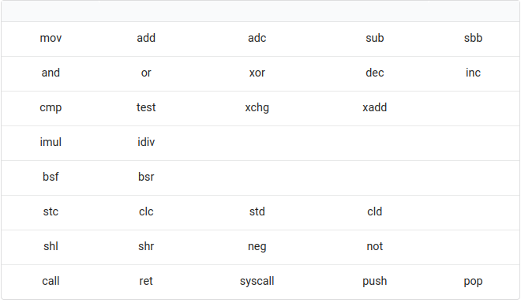

## Mid-term projects
-   Assembler written in Python
-   DisAssembler written in Python
#### These will handle these instructions all 8bit-16bit-32bit-64bit modes:

## Final Project
-   DisAssembler written in Nasm Assembly

